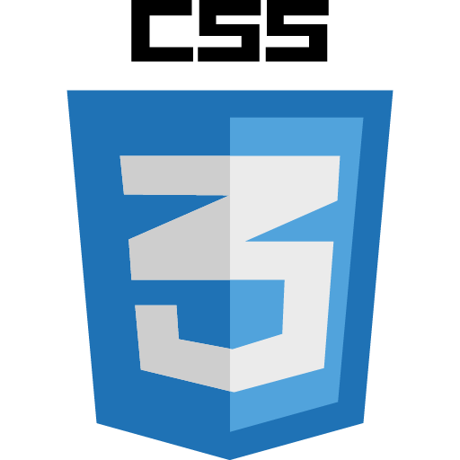

______________________________________________________________________________________________________________________________________________

 
 
<h2> Hello 👋, My name is Kunal Walunj.</h2>
<h3> I am a software developer.</h3>

______________________________________________________________________________________________________________________________________________

<h3> Profile :</h3>

To work on a challenging project which provides a opportunity to enhance my technical skills and knowledge,
this could provide me an insight into new aspects so it would be helpful for my career.

______________________________________________________________________________________________________________________________________________

<h3> About me :</h3>
<li>🌱 I’m currently learning React-native</li>
<li>💬 Ask me about Front end technologies</li>
<li>📫 How to reach me: kunalwalunj512@gmail.com</li>
<li>⚡ Fun fact: I am very funny</li>

______________________________________________________________________________________________________________________________________________

    <h3></h3>
    

<h3> Skills :</h3>
    
    
    
    
    
    
    
    

______________________________________________________________________________________________________________________________________________

